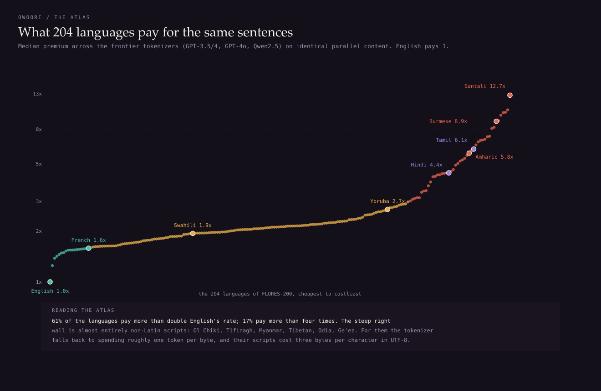
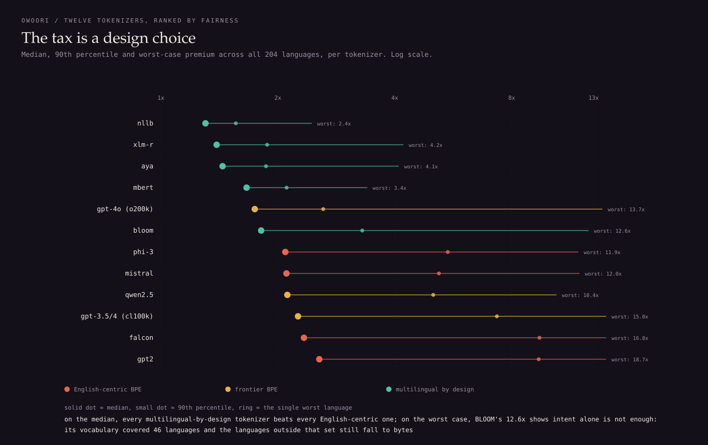
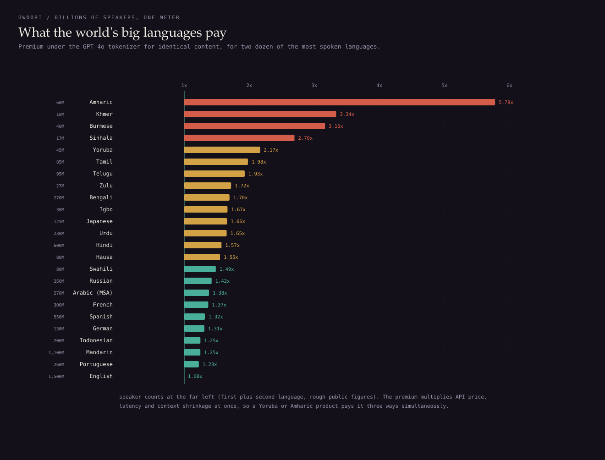
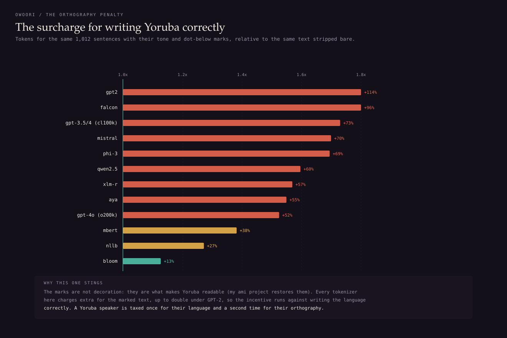

# owóorí

What 204 languages pay for the same sentences, measured across 12 tokenizers.

**Explore any language's bill: [kenny0bi.github.io/owoori](https://kenny0bi.github.io/owoori/)**

*Owóorí* is the Yoruba word for tax, literally "head money", the name of the
colonial-era head tax. This project measures a modern one. Every large
language model charges by the token, and a tokenizer trained mostly on
English needs far more tokens to say the same thing in Yoruba, Amharic or
Santali. That multiplier is a real bill: it multiplies API price, latency and
context-window shrinkage all at once, and almost nobody who pays it knows it
exists.

The measurement design is what makes the comparison fair. FLORES-200 (NLLB
Team, 2022) is the same 1,012 sentences professionally translated into every
language, so token counts are directly comparable as prices for identical
information:

```
premium = tokens(language) / tokens(English), same content
```

I ran all 204 languages through 12 tokenizers: four English-centric BPEs
(GPT-2, Phi-3, Mistral, Falcon), three frontier BPEs (GPT-3.5/4's cl100k,
GPT-4o's o200k, Qwen2.5), and five multilingual-by-design vocabularies
(NLLB, XLM-R, mBERT, Aya, BLOOM). 2,448 measurements, all in
[benchmarks/measurements.json](benchmarks/measurements.json), also published
as a dataset:
[huggingface.co/datasets/kenny0bi/tokenizer-tax](https://huggingface.co/datasets/kenny0bi/tokenizer-tax).

## What the sweep found



At the frontier (median of cl100k, o200k and Qwen2.5), **61% of the 204
languages pay more than double** English's rate for identical content, and
**17% pay more than four times**. The worst premiums are not obscure edge
cases of grammar; they are scripts. Santali (Ol Chiki script) pays 12.74x,
Shan and Burmese (Myanmar script) about 9 to 10x, Tamazight (Tifinagh) 10x,
Amharic (Ge'ez) 5.78x under GPT-4o. The mechanism is byte fallback: when a
tokenizer's merge table has never seen a script, it spends roughly one token
per UTF-8 byte, and these scripts cost three bytes per character. `hello` is
one GPT-2 token; ọkọ̀ (vehicle) is nine, one per byte.


(Source: [assets/manim_fallback.py](assets/manim_fallback.py), video in
[assets/fallback.mp4](assets/fallback.mp4).)

## The tax is a design choice, not a fact of nature



The same language's bill varies by an order of magnitude depending on whose
tokenizer prices it. NLLB's vocabulary, built to cover exactly these 200
languages, holds every single one below 2.45x, median 1.30x. GPT-2's holds
the median at 2.56x with a worst case of 18.69x. Amharic pays 5.78x under
GPT-4o and 1.29x under NLLB. Santali pays 13.70x under GPT-4o and 0.94x
under mBERT, cheaper than English.

Two honest caveats cut both ways. Intent alone is not enough: BLOOM is
multilingual by design, but its training set covered 46 languages, and the
158 outside it still fall to bytes (worst case 12.62x). And bigger
vocabularies help but do not fix it: o200k doubled cl100k's vocabulary and
cut the median from 2.25x to 1.74x, yet Santali got *worse*, because the new
slots went where the training data was.



This is not a small-language problem. Hindi (600M speakers) pays 1.57x,
Bengali (270M) 1.70x, Tamil 1.98x, Amharic 5.78x. Multiply by speaker counts
and billions of people are on the expensive side of the meter.

## The second tax: orthography



Written Yoruba depends on tone and dot-below marks (my
[ami](https://github.com/Kenny0bi/ami) project restores them). I priced the
same 1,012 Yoruba sentences with and without their marks: under GPT-4o the
marked text costs **1.52x** the stripped text, and under GPT-2 it costs
2.14x. Only BLOOM, which actually trained on Yoruba, keeps the surcharge
near noise (1.13x). The economic incentive runs against writing the language
correctly, which is exactly the direction that erodes an orthography online.

## Reading the numbers honestly

- The premium measures token counts, not model quality. A cheap tokenization
  can still feed a model that is bad at the language, and NLLB's flat prices
  come with a 256k vocabulary that costs parameters and compute elsewhere.
- FLORES-200 is written, formal-register text. Informal usage, code-switching
  and dialect will tokenize differently; the parallel design only guarantees
  comparability on this register.
- Llama and Gemma tokenizers are gated downloads and are not in the sweep.
- Speaker counts in the figures are rough public figures used for scale,
  not precise claims.

## Reproduce it

```bash
python -m venv .venv && .venv/bin/pip install numpy tokenizers tiktoken \
    huggingface_hub pytest
bash data/get_data.sh                  # FLORES-200 devtest, ~25MB

.venv/bin/python -m pytest tests/ -q   # 9 contracts
.venv/bin/python benchmarks/run_sweep.py   # ~20 min on a 2014 4-core CPU
.venv/bin/python assets/make_visuals.py    # the four figures
```

## Layout

- [owoori/measure.py](owoori/measure.py) the sweep: loading, counting, the
  premium definition, the diacritic surcharge
- [owoori/analyse.py](owoori/analyse.py) measurements to story: rankings,
  script aggregation, the explorer payload (every number the figures and the
  page state comes from its output, so they cannot drift apart)
- [docs/](docs/) the interactive explorer, a static page over
  [docs/data.json](docs/data.json)
- [assets/make_visuals.py](assets/make_visuals.py) the four figures,
  hand-built SVG, no plotting library
- [tests/](tests/) contracts, including the regression that caught FLORES
  shipping Mandarin as `zho_Hans` while my speaker table said `cmn_Hans`,
  which had silently dropped 1.1 billion speakers from a figure

## Papers

- NLLB Team (2022), *No Language Left Behind: Scaling Human-Centered Machine
  Translation*. The FLORES-200 benchmark and the NLLB tokenizer.
- Petrov et al. (2023), *Language Model Tokenizers Introduce Unfairness
  Between Languages*. The prior art on tokenizer premiums; this project
  extends the measurement to current frontier tokenizers and adds the
  orthography surcharge.
- Ahia et al. (2023), *Do All Languages Cost the Same? Tokenization in the
  Era of Commercial Language Models*. The economic framing.
